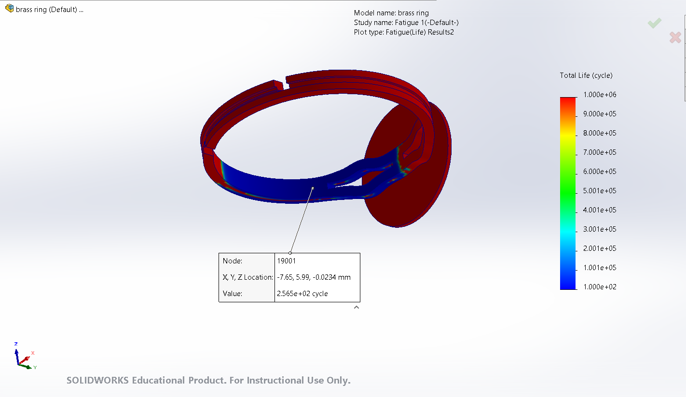

# Adjustable Metal Rings – Failure Analysis, Characterization & Optimization

**Christopher Santiago Garcia** | [christophersantiago910@gmail.com](mailto:christophersantiago910@gmail.com) | [LinkedIn](https://www.linkedin.com/in/christopher-santiago-garcia)

**University of California: Los Angeles**  
*Materials Science and Engineering Capstone Project*

---

## Table of Contents
- [Project Overview](#project-overview)
- [Phase I: Initial Characterization (MSE 140A)](#phase-i-initial-characterization-mse-140a)
  - [Objectives](#objectives)
  - [Experimental Methods](#experimental-methods)
  - [Key Results](#key-results)
- [Phase II: Optimization & Simulation (MSE 140B)](#phase-ii-optimization--simulation-mse-140b)
  - [Annealing Study](#annealing-study)
  - [Grain Size Analysis](#grain-size-analysis)
  - [Finite Element Analysis](#finite-element-analysis)
- [Material Screening & Selection](#material-screening--selection)
- [Key Takeaways](#key-takeaways)
- [Directory Structure](#directory-structure)
- [Authors](#authors)

---

## Project Overview

This repository presents a comprehensive study of failure modes and material improvements for low-cost, gold- and silver-plated adjustable brass rings. These rings suffer from premature failure due to repeated mechanical deformation during size adjustments. Over two academic quarters, this project explored the mechanical behavior, compositional makeup, microstructure, and fatigue performance of these rings, followed by processing optimizations using annealing and design validation via finite element simulations.

---

## Phase I: Initial Characterization (MSE 140A)

### Objectives
- Identify the base metal and coating layers of the rings.
- Quantify hardness, density, and plating thickness.
- Analyze microstructure and determine grain size.
- Construct a fatigue testing setup and establish baseline durability.

### Experimental Methods

- **X-ray Fluorescence (XRF):** Used to determine the ring’s base composition as α-brass (65% Cu / 35% Zn).
- **Vickers Hardness Testing (ASTM E92):** Determined mechanical hardness of plated rings.
- **Density Measurement (ASTM E617):** Compared calculated density to known brass values.
- **Optical Microscopy & SEM (ASTM B487, B748):** Measured plating thickness and surface integrity.
- **Fatigue Testing:** Custom Arduino-controlled linear actuator applied repeated uniaxial tensile loads to simulate daily ring resizing.

### Key Results

| Test                          | Gold-Plated Ring     | Silver-Plated Ring   |
|-------------------------------|-----------------------|------------------------|
| Vickers Hardness (HV)         | 150.8 ± 10.0          | 148.4 ± 4.1            |
| Average Density (g/cm³)       | 9.799                 | 9.720                  |
| OM Plating Thickness (μm)     | 15.24 ± 8.25          | 22.27 ± 5.29           |
| SEM Plating Thickness (μm)    | 11.39 ± 3.18          | 21.30 ± 7.00           |
| Fatigue Life (baseline)       | ~343 cycles           | ~343 cycles            |

Figures:

**Figure 1.** Optical microscope image of gold-plated ring showing average coating thickness.


**Figure 2.** Optical microscope image of a silver-plated ring showing silver coating thickness.


**Figure 3.** SEM cross-section image of gold-plated ring showing layer interface and coating depth.


 
**Figure 4.** SEM cross-section image of silver-plated ring showing layer interface and coating depth.


---

## Phase II: Optimization & Simulation (MSE 140B)

### Annealing Study

Objective: Determine how controlled heat treatments affect ductility, grain structure, and fatigue life.

**Annealing Parameters:**
- **Temperature:** 550°C (to avoid β-phase in brass)
- **Time:** 1, 5, 10, 15, 30, 45 minutes
- **Cooling:** Air-cooled

**Hardness vs Time**

| Annealing Time (min) | Hardness (HV) |
|----------------------|----------------|
| 15                   | 161.3          |
| 30                   | 128.3          |
| 45                   | 70.7           |

**Fatigue Life (Cycles)**

| Time (min) | Gold | Silver |
|------------|------|--------|
| 1          | 188  | 450    |
| 5          | 270  | 465    |
| 10         | 483  | 236    |
| 15         | 614  | 417    |
| 30         | 119  | 316    |
| 45         | 136  | 360    |

Figures:
 
**Figure 5.** Fatigue life of gold- and silver-plated rings as a function of annealing time at 550°C. Gold-plated rings showed peak performance at 15 minutes.

---

### Grain Size Analysis

- Grain sizes were calculated via the intercept method (ASTM E112).
- Etched samples revealed increasing grain diameter at prolonged annealing times.
- Yield strength estimates were calculated via the Hall-Petch relationship and Tabor’s relation.

| Time (min) | Grain Size (μm) | Yield Strength (MPa) (Hall-Petch) |
|------------|------------------|------------------------------------|
| 15         | 36.24            | 91.66                              |
| 30         | 29.63            | 98.56                              |
| 45         | 43.89            | 85.77                              |

---

### Finite Element Analysis

Used SolidWorks Simulation to replicate the experimental setup:

- **Static Simulation:** Applied 10 N force to ring arm.
- **Fatigue Life Prediction:** Simulated number of cycles before failure.

**Simulated Cycles to Failure**

| Material     | Cycles |
|--------------|--------|
| Brass        | 257    |
| Titanium     | 452    |
| Steel        | 2393   |
| Aluminum     | 108    |
| Zinc         | 170    |
| Silver       | 114    |

Figures:


**Figure 6.** Static stress simulation on the ring under 10 N applied force using SolidWorks. High stress concentration appears near the inner edge.


**Figure 7.** Fatigue simulation result predicting failure after 257 cycles, closely matching experimental fatigue test results (~256 cycles).


---

## Material Screening & Selection

Used Ashby plots to screen and rank materials for:
- Minimum 50 HV hardness
- Minimum 100 MPa fatigue strength @ 10⁷ cycles
- Minimum 10% elongation

Final materials were ranked using a Figure of Merit:

| Material        | FoM (Normalized) |
|-----------------|------------------|
| Brass           | 1.000            |
| Titanium        | 0.849            |
| Stainless Steel | 0.574            |
| Low Carbon Steel | 0.098           |
| Aluminum Alloy  | 0.021            |
| Zinc Alloy      | 0.011            |
| Sterling Silver | 0.000            |

Figures:


**Figure 8.** Ashby plot screening materials based on Vickers hardness and density, identifying candidates above 50 HV.


---

## Key Takeaways

- **Annealing** significantly improves fatigue life if optimized (~15 min best).
- **Silver rings** show more consistent fatigue performance; gold rings are more sensitive to heat treatment.
- **Brass** remains the best choice for balancing cost, machinability, and performance.
- **Simulation and experiment** closely matched (257 vs 256 cycles).
- **Material ranking** confirmed brass outperforms others in cost-performance tradeoff.

---

## Directory Structure

```
├── images/                 # Simulation, SEM, OM, Ashby plots
├── data/                   # Raw & processed experimental results
├── scripts/                # Python scripts for Ashby plots
├── report/                 # Final report PDFs, figures
└── README.md               # This file
```

---

## Authors

Christopher Santiago  
Sakshi Agte  
Maria Carrillo  
Nehmat Sandhu   
Ashwyn Yeo  

Department of Materials Science & Engineering  
University of California, Los Angeles (UCLA)


